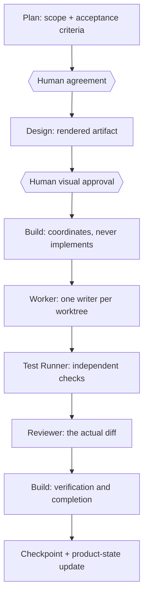

# KSI OpenCode Harness

[](https://github.com/khakisketch/KSI-Opencode-Harness/actions/workflows/check.yml) · [MIT](LICENSE) · Node `>=20`

A plugin that adds **Plan / Design / Build / Verify** boundaries to OpenCode's native agent and task graph. Model-neutral, evidence-first, and free of role spam — not a model server, not a standalone runtime, and it never picks or silently upgrades your model.

> ### More agents is not a strategy.
>
> A real development pipeline for AI coding agents: every stage has an owner, an artifact, and a gate. Every completion claim is verified before it counts.


- **Bounded roles, not role spam.** Six reserved subagents with fixed budgets and permissions. Workers cannot recurse; there is no do-anything agent.
- **One writer at a time.** Product and integration edits go to one Worker per worktree, batched when small; writers stop before independent testing.
- **Authors never verify themselves.** Test Runner executes the checks; a Reviewer inspects the actual diff, not the producer's reasoning.
- **Human gates stay human.** Plan agreement and visual design approval are explicit; nothing commits, pushes, or merges itself.
- **Model-neutral by contract.** No provider/model/variant selection, no silent substitution, no local-to-cloud fallback.
- **Continuity built in.** Checkpoint + product state + plan ledger, injected at session start and after compaction — with a shared CLI for Codex and Claude.

## Quickstart

1. **Ask your agent to install it** — [INSTALL.md](INSTALL.md) travels with the prompt so every collision and permission change is shown before approval (prompt below).
2. **Or add the plugin yourself**, pinning a reviewed commit:

```jsonc
"plugin": [
  "ksi-opencode-harness@git+https://github.com/khakisketch/KSI-Opencode-Harness#<reviewed-commit>",
  "superpowers@git+https://github.com/obra/superpowers.git#b36e0829c6d0140e93cfef2ca599b1b07d4a7797"
]
```

3. **Restart the full OpenCode process.** Your conversation survives; new calls pick up the new permissions.

There is no npm package and no GitHub Release: install from a pinned source commit, and expect the install agent to show you every name collision and changed grant before applying anything.

## How a task moves



The diagram encodes rules, not suggestions:

- Product and integration edits are always delegated — even small fixes are batched to one Worker; Build coordinates and verifies but does not implement.
- Only Plan and Build can call native `task`; workers cannot delegate further, and no general-purpose agent bypasses the graph.
- Writers stop before independent tests; reviewers review what actually changed.
- Completion requires task evidence **and** human acceptance of the slice; `/complete` and `/review` ask for the graph, never for self-approval.

## Why so few roles

Agent tooling loves a cast of twelve. Here, a role is a permission boundary and a step budget — it has to earn its place:

- **No recursion.** Workers cannot spawn workers.
- **One writer per worktree.** Parallel writers require explicitly separated worktrees and disjoint ownership.
- **No role theater.** No standing architect, no mandatory critique for tiny changes, no design approval inferred from source code.
- **Budgets in the open.** Defaults: Build 200, Design 60, Explore 20, Developer 80, Test Runner 24, Reviewer 32, Research 20, Design-task 40 native steps. Your `model`, `variant`, and positive `steps` settings survive installation; unsupported models surface as errors, never as substitutes.
- **A rendered artifact or nothing.** Material visual approval is tied to something the user actually inspected — a real render at a recorded version and scope, not a promise.

## What this is not

- Not an agent swarm — no dynamic hierarchy, no recursion, no unbounded autonomy.
- Not a model router — it never selects, substitutes, or auto-upgrades providers, models, variants, or thinking effort.
- Not an autonomous release machine — no commit, push, PR, merge, release, or deploy without explicit human authorization.
- Not a benchmark — no performance or cost claims; verification is per-task evidence, and unverified boundaries are labeled.
- Not a skill fork — official Superpowers stays pinned and unmodified as a separate plugin.

## Proof

This repository is developed through the same pipeline it ships: plan ledgers in [`docs/superpowers/plans/`](docs/superpowers/plans/), bounded worker contracts, `npm test` (200+ tests), package checks, and independent review before anything lands. Evidence over vibes — check the repository history and the ledgers.

## Roles and steps

| Role | Called by | Default native steps |
| --- | --- | ---: |
| `build` (Primary) | user-selected | 200 |
| `design` (Primary) | user-selected | 60 |
| `explore` | Plan, Build | 20 |
| `developer` | Build | 80 |
| `test-runner` | Build | 24 |
| `reviewer` | Plan, Build | 32 |
| `research` | Plan, Build | 20 |
| `design-task` | Build | 40 |

Complex developer work uses the default 80 steps; Build may approve an explicit 120-step condition only when the handoff documents coupled state, concurrency, migration, or deliberate repair scope. `steps` are native iteration budgets — not token budgets, thinking effort, or nested-agent depth. See [docs/execution.md](docs/execution.md).

## Continuity

- `<worktree>/.opencode/working-state.md` — a rolling checkpoint (≤80 lines, ≤6 KiB): the resume pointer, read before continuing, rewritten at milestones only.
- `docs/superpowers/product-state.md` — the per-project source of truth: goal, milestones, current slice + acceptance, and backlog. Updated only at slice close.
- `docs/superpowers/plans/<date>-<topic>.md` — one execution ledger per workstream; `done` requires recorded verification evidence.
- **Goals stay native.** Long-running work can run under each tool's own `/goal` (built-in in Claude and Codex; OpenCode via the pinned companion plugin `@prevalentware/opencode-goal-plugin@0.1.49`) while the checkpoint carries one canonical `Goal:` line, so every tool sees the same objective.

Sessions receive the checkpoint and the current slice automatically (≤5000 bytes combined, labeled untrusted, read-only, non-blocking when absent) — natively in OpenCode, and in Codex or Claude through the bundled CLI registered as a SessionStart hook:

```text
node <repo>/bin/ksi-continuity-inject.mjs
```

Hook registration and trust stay with you: the installer does not modify `~/.codex` or `~/.claude`.

## Install

Your agent installs it, with you approving the merge:

```text
Read INSTALL.md from the reviewed source or Git distribution. Inspect this PC first.
Install KSI OpenCode Harness and the pinned official Superpowers as two separate
OpenCode plugins. Preserve my Plan/Build models, credentials, shared Codex/Claude
installs, and unrelated MCP/provider settings. Explain that KSI manages Plan
permission, enforces coordinator-only Build permissions (bookkeeping writes only),
and replaces the six reserved subagent definitions, preserving each definition's
model/variant and valid positive integer native steps; preserve Plan's other
settings and Build model/variant/steps. Design is primary-only: preserve its native
model preferences, and review its managed prompt/permissions and scoped preview/UI
paths before installation. Show every name collision and changed grant/denial for
my approval, and stop if I decline a conflict. Do not substitute a missing model.
Validate, restart the full OpenCode process, continue the conversation if desired,
and report the result. Ask before any billable live model smoke test.
```

### What the installer owns

| Area | Install behavior |
| --- | --- |
| Plan permission | replaced with the KSI-managed value |
| Six reserved subagent definitions | replaced by KSI role definitions; only `model`, `variant`, and valid positive integer `steps` survive |
| Plan's other settings | preserved |
| Build config | `model`/`variant`/`steps` preserved; tool permissions replaced with coordinator-only (bookkeeping writes only — no product edits, no shell) |
| Name collisions | every collision and changed grant/denial shown before approval |
| Credentials, providers/MCP, shared Codex/Claude installs | untouched |

[`opencode.jsonc.example`](opencode.jsonc.example) is a merge reference, not a replacement. Full procedure: [INSTALL.md](INSTALL.md).

## Verification and limits

Source-checkout checks:

```bash
npm test
npm run check
npm run check:package
git diff --check
```

The CI matrix runs Ubuntu, macOS, and Windows on Node 20 and 22. The badge reflects the published `main` commit and does not verify uncommitted changes. Not verified by any of this: live model smoke tests, other OS/PC combinations, remote source publication after your pin, or human acceptance. Live calls can consume quota and transmit provider data — they run only with explicit approval.

## Documentation

- [INSTALL.md](INSTALL.md) — agent install, source pinning, merge and migration boundaries
- [docs/architecture.md](docs/architecture.md) — native role graph and ownership
- [docs/design.md](docs/design.md) — Design Primary, approval gates, browser pipeline
- [docs/execution.md](docs/execution.md) — steps, model/variant discovery, opt-in helper lifecycle
- [docs/verification.md](docs/verification.md) — checks, audit meaning, unverified boundaries
- [docs/troubleshooting.md](docs/troubleshooting.md) — startup/session/provider diagnostics
- [docs/releasing.md](docs/releasing.md) — manual publication after a source push
- [examples/design.project.jsonc](examples/design.project.jsonc) — narrow Design edit paths
- [examples/design-handoff.md](examples/design-handoff.md) — short handoff template

## 한국어 요약

영어 문서가 기준입니다. 아래는 빠른 요약입니다.

- **한 줄:** "에이전트를 더 늘리기"가 아니라 **Plan → Design → Build → Verify → State** 파이프라인을 강제하는 OpenCode 플러그인입니다.
- **역할:** 여섯 reserved subagent는 고정된 step 예산과 권한을 가집니다. 재귀 위임이 없고, 작은 수정도 Worker에게 배치되며, Build는 조정·검증만 합니다.
- **작성자≠검증자:** writer가 멈춘 뒤 Test Runner가 검사하고 Reviewer가 실제 diff를 봅니다. 완료는 task 증거 + slice acceptance(사용자 end-to-end 확인) 둘 다 필요합니다.
- **사람 게이트:** 계획 합의와 시각 디자인 승인은 명시적입니다. 승인 없는 커밋·푸시·merge·배포는 없습니다.
- **모델 중립:** provider/model/variant/effort를 고르거나 대체하지 않습니다. 없는 모델을 조용히 바꾸지 않습니다.
- **연속성:** 체크포인트·product-state·ledger를 세션 시작/compaction에 주입합니다(≤5000B, untrusted, 읽기 전용). Codex·Claude는 같은 CLI를 SessionStart hook으로 씁니다.
- **설치:** npm/Release 없음 — 검토한 커밋으로 pin해 설치하고, 설치 에이전트가 모든 권한 변경을 승인받습니다. [INSTALL.md](INSTALL.md)
- **한계:** CI 배지는 게시된 main만 검증합니다. live model smoke·타 PC·human acceptance는 별도입니다.

## License

MIT — see [LICENSE](LICENSE).
