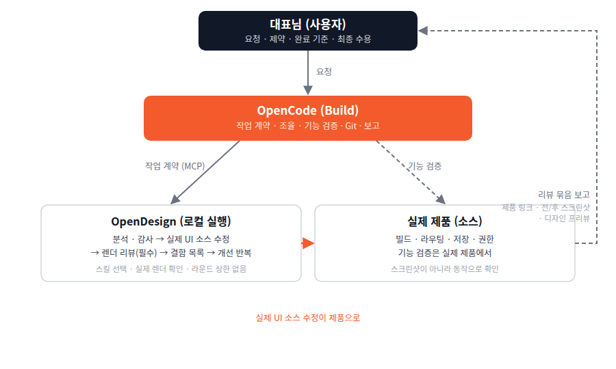

# KSI OpenCode Harness

### AI에게 일을 맡기되, 방향과 완료의 기준은 사람이 정합니다.

**KSI는 OpenCode를 대화의 중심에 두고, 필요한 역할과 도구만 연결해 제품을 만듭니다.**
먼저 무엇을 바꿀지 합의하고, 실제 프로젝트에서 구현하고, 확인한 근거와 남은 일을 함께 보고합니다.

[시작하기](#바로-시작하기) · [작업 흐름](#ksi는-이렇게-작업합니다) · [요청 예시](#실제로-이렇게-요청하세요) · [시각 가이드](docs/walkthrough.md) · [설치 가이드](INSTALL.md)

**OpenCode V2** · **선택형 엔지니어링 역할 3개** · **Beta `0.5.0-beta.8`** · [MIT](LICENSE)

> **운영 방식과 설치 범위는 다릅니다.** 아래는 KSI가 일하는 방식입니다.
> 이 npm 패키지가 설치하는 것은 Developer · Test Runner · Reviewer의 **세 에이전트 파일뿐**입니다.
> 도구 설치, 디자인 연결, 프로젝트 지침, 자동 배포까지 묶어 주는 올인원 플러그인이 아닙니다.

---

## KSI는 이렇게 작업합니다



**목표·권한 합의 → 필요한 만큼 계획 → 구현·통합·검증·로컬 커밋까지 완주 → 결과 확인·외부 반영**

- **Plan**은 필요할 때 요청과 실제 프로젝트를 이해하고 변경 방향·범위·불변조건·완료 증거를 정리합니다.
- **Build**는 승인된 변경의 전체 실행·통합·기술적 완료 근거와 보고를 책임지며, 작업 성격에 따라 직접 구현하거나 전문 실행을 위임합니다.
- **OpenDesign(로컬 실행)**은 연결된 시각적 프론트엔드 전문 구현 환경입니다. 실제 제품 소스 접근·수정 능력이 확인되면 그 소스를 직접 수정하고 렌더·디자인 리뷰·개선까지 맡습니다.

**승인된 목표 안에서는 문제 발견·우선순위 판단·수정·재검증까지 에이전트가 맡습니다.**
구현 후 실제 결과를 검토하고, 결함을 고친 뒤 관련 검사를 다시 수행해 결과를 보고합니다.
개선 목록만 넘기거나 매번 “어느 것부터 고칠까요?”라고 묻지 않습니다. 사용자는 목표와
중요한 결정을 맡고, 일상적인 수정 순서·검사·반복은 맡지 않습니다. 점검만 요청한 작업은
점검 범위를 지키며, 새 범위·디자인 방향·권한·배포 같은 실제 결정은 그대로 구분합니다.
[기본 검토·수정·재검증 루프 →](docs/execution.md#own-the-completion-loop-not-a-list-for-the-user)

디자인 작업은 **제품별 대표 프로젝트를 재사용**하고, 실행 전에 실제 소스 연결을 확인합니다.
화면·작업·브랜치가 달라졌다는 이유만으로 새 프로젝트를 만들지 않습니다. 실제 제품은
기존 제품 서버 링크에서 확인하며, 디자인 파일 미리보기와 로그인·저장·새로고침 검증을
구분합니다. [대표 프로젝트 재사용과 연결 확인 →](docs/integrations/opendesign.md#reuse-the-representative-product-project)

```text
사용자  원하는 결과 · 문제 · 아이디어 · 제약
  │
  ▼
필요하면 Plan  프로젝트와 기존 결정 이해
               변경 방향 · 범위 · 불변조건 · 완료 증거 정의
  │
  ▼
Build  전체 실행·통합 책임 — 필요한 조사·구현·검토를 조율
  │
  ├─ 비시각적 Engineering
  │    ├─ Build 직접 구현
  │    └─ Developer: 맡겨진 엔지니어링 구현·수정
  │
  ├─ Visual Frontend
  │    └─ OpenDesign(로컬 실행): 연결된 전문 워크스페이스
  │         분석 → 실제 UI source/style 수정 → 렌더
  │         → Design Review → 결함 직접 개선·재확인
  │
  └─ Reviewer: 필요한 시점의 독립적인 코드·동작 검토
  │
  ▼
Build  결과 통합 · 실제 제품의 기능 계약 확인
       결함 재분류 → 담당 경로에서 수정·재위임
  │
  ▼
Test Runner  통합된 버전의 마일스톤·완료 독립 최종 검사
  │
  ▼
Build  완료 근거 확인 · 작업 단위 로컬 커밋 · 결과 보고
  │
  ▼
사용자  실제 제품 결과 확인·수락 · 중요한 판단·외부 반영 권한
```

명확한 작업은 **Plan을 거치지 않고 Build에서 바로 시작**할 수 있습니다. Plan과 Build는 책임이 다른 기본 모드이지, 모든 요청에서 순서대로 호출해야 하는 두 단계가 아닙니다. Explore 등은 필요할 때 조사를 돕습니다.

위 그림은 **책임과 완료 근거의 흐름**입니다. OpenDesign은 내부 child agent나 또 다른 개발 Primary가 아니라 연결된 전문 실행 환경입니다. Build가 목적·필요한 결과·보존할 기능/API/데이터/권한/브랜드 계약을 전달하고, 디자인 쪽은 그 안에서 레이아웃·정보 계층·컴포넌트 구성·반응형 표현을 판단하고 구현할 재량을 가집니다. Build가 시각적 세부 구현을 대신 결정하는 구조가 아닙니다.

기존 화면 재설계는 감사부터, 새롭거나 모호한 방향은 옵션 선택부터 시작합니다. 큰 작업은 실제 렌더를 읽는 별도 디자인 리뷰 단계가 필요하며, 새 시각 방향·고객 납품물·범위 밖 변경·선검토 요청은 승인 게이트를 유지합니다. 작은 수정은 간결하게 실행합니다. [감사·방향 선택·리뷰와 작은 수정의 구분 →](docs/integrations/opendesign.md#design-quality-loop-design-owned-analysis-review-and-refinement)

### 작업 크기보다 작업 성격으로 소유권을 나눕니다

| 책임 | 담당 | 범위 |
| --- | --- | --- |
| **Visual Frontend** | OpenDesign(로컬 실행) | UI/UX 분석, 레이아웃·정보 계층·컴포넌트 표현, 실제 UI source/style, 반응형·시각적 상호작용 상태, CSS·간격·overflow, 렌더 리뷰·개선 |
| **Engineering** | Build / Developer | API·데이터·인증·권한·업무 상태·저장·비시각적 클라이언트 로직 |
| **통합·기술적 완료 근거** | Build | 계약·제약 전달, 기능 검증 조율, 결과 통합, 결함 분류·재위임, Git·보고 |
| **독립 최종 검사** | Test Runner | 통합된 버전의 실제 검사 실행과 결과·미확인 항목 보고 — 자체 테스트나 Reviewer 검토로 대체하지 않음 |
| **독립 코드·동작 검토** | Reviewer | 읽기 전용 검토와 결함 지적 — Test Runner 검사·디자인 리뷰·사용자 수락을 대신하지 않음 |

**작은 CSS 간격 수정은 디자인 쪽, 큰 DB 마이그레이션은 엔지니어링 쪽**입니다. 크기는 얼마나 무겁게 실행할지, 성격은 누가 소유할지를 결정합니다. 같은 파일에 두 영역이 섞여 있으면 순차 인계하며, 한 번에 한 작성자만 수정합니다.

디자인 실행이나 필요한 소스·렌더 검수 경로가 준비되지 않으면 해당 단계의 차단을 보고하고 독립적인 비시각 작업만 계속합니다. **연결 불가를 이유로 Build나 Developer가 시각적 구현을 대신하지 않습니다.** [접근 확인·차단 시 처리 →](docs/integrations/opendesign.md#resolve-once-verify-the-actual-capability)

### 자체 테스트와 독립 최종 검증은 다릅니다

아래 운영 지침을 채택한 작업에서는 **마일스톤·완료의 최종 검사를 Test Runner가 독립 실행**합니다. Build와 Developer의 개발 중 실패 재현·TDD·자체 테스트는 허용되지만 그 검사를 대신하지 않습니다. Build는 통합된 코드 버전의 검사 명령·결과·미확인 항목을 확인하고, 이후 관련 코드가 바뀌면 영향을 받는 검사를 다시 요청합니다. Reviewer의 코드·동작 검토와 디자인 쪽의 렌더 리뷰는 서로 다른 근거입니다.

**디자인 작업 성공 ≠ 전체 제품 변경 완료.** 화면을 개선했어도 API 연결·권한·저장이 깨졌다면 Build가 실제 제품에서 확인하고, 비시각적 결함은 직접 또는 Developer에게, 시각적 결함은 디자인 쪽에 돌려 수정한 뒤 재검증합니다. 기술적 완료 근거·사용자 수락·push/deploy 등 외부 반영은 각각 구분합니다.

### 세 가지 원칙

| 원칙 | 실제로는 이렇게 합니다 |
| --- | --- |
| **작게 맡기기** | 비시각적 수정은 Build가 처리하고, 작은 CSS·화면 수정은 디자인 쪽에 간결하게 맡깁니다. 전체 감사나 새 요구사항 인터뷰는 필요하지 않습니다. |
| **책임을 분리하기** | 전문 영역의 구현 재량은 담당 경로에 두고, Build가 통합·기술적 완료 근거·최종 보고를 맡습니다. |
| **확인한 것만 완료라 하기** | “테스트 통과”, “배포됨”, “사용자가 만족함”을 서로 다른 상태로 보고합니다. |

이 흐름은 **정의된 운영 계약이지, 런타임이 강제로 보장하는 워크플로 엔진은 아닙니다.** 프롬프트와 권한으로 역할을 안내하며, 설치나 테스트 통과만으로 실제 역할 준수·제품 품질을 보장하지 않습니다. OS 샌드박스도 제공하지 않습니다.

**Reviewer의 ‘읽기 전용’은 모든 쓰기 경로 차단을 뜻하지 않습니다.** Reviewer·Test Runner는 native `edit`와 재위임을 거부하지만, shell·MCP·Code Mode 등의 유효 권한은 기존 설정을 상속합니다. 다른 도구로 구현·설정·외부 데이터를 바꾸지 않는 것은 역할 지침이며, Test Runner의 승인된 검사는 예상된 임시 산출물을 만들 수 있습니다. 강제 격리가 필요하다면 별도의 권한·실행 환경 설계가 필요합니다. 설치 도구가 이를 자동 적용하지는 않습니다.

### 승인된 개발은 중간 확인 없이 완주합니다

[선택형 자율 개발 지침](examples/autonomous-development.md)을 실제 `AGENTS.md`에 반영하면, Build에 승인된 구현·필요한 위임·통합·검증·작업 단위 로컬 커밋을 맡길 수 있습니다. “다음 진행할까요?”나 “커밋할까요?”를 단계마다 묻지 않고, 중요한 진행 상황을 보고하면서 이어갑니다. 명시적인 커밋 금지나 저장소 제약은 우선합니다.

사용자에게 돌아오는 경우는 **최종 결과 보고, 중요한 범위·제품·디자인 결정, 비용·위험 증가, 승인되지 않은 외부 영향, 파괴적·보안 민감 작업, 실제 차단 또는 실행 예산 소진**입니다. 해결 가능한 테스트 실패나 중간 작업 완료는 멈출 이유가 아닙니다.

푸시·공개·배포는 대상과 영향을 승인받아야 하지만, 처음부터 승인했다면 같은 승인을 다시 묻지 않습니다. 단, 대상·영향·위험이 중대하게 바뀌면 새 승인이 필요합니다. 네이티브 도구·인증 승인은 별개입니다. 기술적 완료·사용자 수락·외부 배포를 구분하며, 수락 대기를 이유로 남은 승인 작업을 멈추거나 새로운 과업을 임의로 시작하지 않습니다.

이 정책은 설치 도구가 자동 적용하지 않습니다. 기본 Build/Plan, 모델·권한·upstream 스킬은 유지합니다. 응답 종료 뒤의 자동 계속 실행은 명시적으로 요청한 세션 목표 등 별도 기능이며, 지침만으로 무제한 실행을 보장하지 않습니다.

채택한 운영 지침에서는 **브랜치·워크트리 생성, 세션 연결, 검증, 안전한 로컬 통합·작업 공간 정리를 Build가 맡습니다.** 사용자가 작업 공간 목록을 보며 단계마다 지시할 필요가 없습니다. UI 변경은 실제 제품 서버에서 필요한 흐름·저장 결과·키보드·화면 크기 등을 확인하되, 작은 수정마다 전체 감사나 중복 브라우저 검증을 강요하지 않습니다. [작업 공간·브라우저 검증 절차 →](docs/execution.md)

기본은 **현재 체크아웃·브랜치에서 한 작성자가 작업**하는 것입니다. 계획이 있거나 기능이 크다는 이유만으로 워크트리를 만들지 않습니다. 여러 화면을 기존 브랜드로 통일하는 내부 도구 작업은 대표 화면을 실제 소스에서 구현·검증한 뒤 한 번 리뷰하고, 그 결과를 승인하면 나머지는 화면별 승인 없이 단계 검증하며 전개합니다.

### 상태 확인과 멈춤도 자연어로

- **“지금 어디까지 됐어?”** — 실제 Git·작업 기록·검증 근거를 대조해 작업 상태, 사용자 확인과 외부 반영을 구분합니다.
- **“이 프로젝트 바로 작업 가능한지 확인해줘.”** — 준비 상태를 읽기 전용으로 확인하며, 파일 존재와 실제 연결·권한 검증을 혼동하지 않습니다.
- **“이 작업 잠깐 멈춰.”** — 채택한 지침에 따라 현재 세션의 자동 계속 실행과 알림 재개를 각각 확인·일시정지합니다. 외부 디자인 실행 취소와는 다르며, 일부 스위치가 없으면 그 사실을 보고합니다.
- **“이어서 진행해줘.”** — 해당 프로젝트 기록의 범위·승인·연결 정보를 재사용하고 현재 상태를 확인합니다. 새로운 목표나 다른 세션 작업을 자동 생성하지 않습니다.
- **“세션이 멈춘 것 같아.”** — 미커밋 작업 보존 → 재시도 → 로그 진단 순서로 복구합니다. 모델·provider 오류는 환경 문제로 분류하고, 전달된 알림이 아직 처리되지 않았을 수 있으므로 대기 중 작업을 다시 확인합니다.

이는 기존 도구와 운영 지침의 흐름이지 새 슬래시 명령이나 강제 실행 기능이 아닙니다. 소스 체크아웃에는 짧은 상태 보고와 준비 점검 도구가 있습니다([사용법·한계 →](docs/execution.md#reuse-project-context-inspect-status-and-preparation)); npm 역할 설치에 포함되지는 않습니다.

## 계획과 결정은 어디에 남나요?

여러 단계의 계획을 요청하면 **제안 상태로 작업 기록에 저장**하고, 승인한 범위와
실제 진행·검증 결과를 구분합니다. 파일을 만들었다고 구현이 승인되는 것은 아닙니다.
단순 질문이나 작은 수정마다 새 기획서를 만드는 방식은 아닙니다.

- **상세 계획·결정·검증:** `docs/superpowers/plans/`의 해당 작업 기록 한 곳
- **제품 목표·현재 단계:** `docs/superpowers/product-state.md`의 요약과 기록 링크
- **다음 세션 인계:** `.opencode/working-state.md`의 짧은 상태와 기록 링크

**Plan과 Build는 같은 승인된 작업 계획을 이어서 사용합니다.** Plan이 작성했다는
이유만으로 실행이 승인되지는 않습니다. 목표·범위/제외·수용 기준·의존성/순서·검증 방법과
실제 승인 상태를 작업 크기에 맞게 남기고, Superpowers를 사용해도 별도 경쟁 계획을 만들지 않습니다.

Plan의 기본 작성 위치가 `~/.opencode/plan/`이라 저장소 기록을 직접 쓰지 못한다면,
실제 파일 경로·버전/구간·승인 상태·프로젝트 기록 대상을 인계합니다. Build는 원본을 읽고
승인 내용을 보존해 프로젝트 기록으로 옮깁니다. 미승인 초안은 옮겨도 미승인이며,
옮긴 뒤에는 프로젝트 기록을 실행 기준으로 삼아 두 계획을 따로 갱신하지 않습니다.
Build는 그 기준과 실제 Git·구현·검증을 대조해 진척을 갱신하고, Plan은 재평가·수정안을
제안합니다. 작은 수정에 Plan을 강제하거나 기본 프롬프트·권한을 확대하는 방식은 아닙니다.
[Plan→Build 계획·저장·실행 기준 →](docs/execution.md#one-approved-plan-across-plan-and-build)

Build는 작업자에게 필요한 문서 경로·범위·완료 기준을 전달하고, 작업자는 실제로
읽은 기준과 결과·차단 사항을 반환합니다. Build가 공통 기록을 정리합니다.
**문서 공유는 대화 전체의 자동 공유가 아닙니다.** 임시 시범 결과도 결론·검사 근거·한계를
저장소에 요약하며, 원본 로그·인증 정보는 무조건 복사하지 않습니다.
이것은 채택한 운영 지침이고 설치기가 문서를 자동 작성하는 기능은 아닙니다.
[기록 시점·승인 상태·문서 인계 절차 →](docs/execution.md#record-plans-and-bind-handoffs-to-documents)

## 누가 무엇을 맡나요

**주 대화는 OpenCode 기본 Build / Plan에서 이어갑니다.** KSI는 이 역할들을 교체하지 않습니다.

| 역할 | 담당 | 경계 |
| --- | --- | --- |
| **사용자** | 목표, 범위, 권한, 최종 승인 | 테스트가 사용자 승인을 대신하지 않습니다. |
| **Plan** · 기본 | 프로젝트·기존 결정 이해, 변경 방향·범위·불변조건·완료 증거 정리 | 일반 제품 파일 구현은 Build로 넘기며, 모든 수정의 필수 단계는 아닙니다. |
| **Build** · 기본 | 전체 실행·통합·기술적 완료 근거·검증 조율·로컬 커밋·보고 | 비시각적 구현은 직접 또는 위임하며, 시각적 구현은 디자인 쪽에 맡깁니다. 사용자 수락·외부 반영 권한을 대신 결정하지 않습니다. |
| **Explore** · 기본 | 기존 코드와 구조 조사 | 구현 담당이 아닙니다. |
| **Developer** · KSI | 맡겨진 비시각적 엔지니어링 구현·수정·자체 테스트 | 스스로 과업을 확장하거나 시각적 구현·독립 완료 검증을 대신하지 않습니다. |
| **OpenDesign(로컬 실행)** · 별도 연결 | 시각적 판단·실제 UI source/style 수정·렌더·디자인 리뷰·직접 개선 | 내부 child agent나 별도 개발 Primary가 아닙니다. 제품 전체의 통합 책임이나 사용자 승인을 대신하지 않습니다. |
| **Test Runner** · KSI | 통합된 버전의 마일스톤·완료 독립 최종 검사, 성공·실패·미확인 근거 보고 | 제품 구현이나 최종 승인 담당이 아닙니다. |
| **Reviewer** · KSI | 읽기 전용 코드·동작 검토 | 코드를 수정하거나 디자인 취향을 승인하지 않습니다. |

OpenCode에는 General 등 다른 기본 역할도 있습니다. 위 표는 KSI의 대표 작업 흐름에 쓰이는 역할입니다.
구현 위임·조사·코드 검토는 필요에 맞게 선택하되, 채택한 완료 계약의 독립 검증을 자체 테스트로 대체하지 않습니다. 모델·provider·reasoning variant·step budget은 사용자가 결정합니다.

**Developer는 명확한 비시각적 구현 과업의 조사·구현·자체 테스트에 적극 활용합니다.** Build는 목적·계약·완료 기준을 간결하게 전달하고, 반환된 실제 diff를 확인해 통합·복구를 책임집니다. 맥락이 강하게 얽힌 판단이나 명백한 통합 수정은 직접 처리할 수 있습니다. 강제 위임·사용률 목표·위임을 위한 작업 쪼개기는 하지 않습니다([과업 전달·반환·복구 기준 →](docs/execution.md#use-developer-effectively-without-mandatory-delegation)).

## 실제로 이렇게 요청하세요

명령어를 외울 필요 없이 **결과와 제약을 자연어로 전달**하면 됩니다. 아래는 KSI 전용 슬래시 명령이 아닙니다.

### 01 · 작은 수정 — 담당을 나눠 간결하게 처리

> “저장 실패 후 재시도 로직을 고쳐줘. 화면은 그대로 두고 저장·재시도 검사 결과를 알려줘.”

비시각적 로직은 Build가 직접 또는 Developer에게 맡겨 구현하고, 통합·검증을 책임집니다. 버튼 배치·스타일·반응형 같은 시각적 수정은 작더라도 디자인 쪽이 실제 소스에서 수정·렌더 확인하고, Build가 기능을 검증합니다. 작은 시각 수정마다 새 인테이크나 전체 화면 감사를 하지는 않습니다.

### 02 · 큰 기능 — 합의하고 나눠서 구현

> “관리자가 주문을 취소하는 기능이 필요해. 먼저 기존 구조와 예외 상황을 조사해서 계획을 제안해줘. 승인한 뒤에는 필요한 위임·구현·통합·검증·로컬 커밋까지 중간 진행 확인 없이 완주해줘. 푸시·배포는 별도 승인 전에는 하지 마.”

Plan에서 방향을 합의하고 Build에서 실행합니다. 역할을 나눠도 통합 책임은 Build에 남습니다.

### 03 · 새 디자인 — 실제 제품 소스에서

> “이 프로젝트의 예약 화면을 새로 디자인하고 싶어. 연결된 실제 프로젝트를 확인하고, OpenDesign(로컬 실행)이 제품 소스에서 직접 작업하게 해줘. 방향이 크게 바뀌면 먼저 보여주고, 구현·검증까지 진행해줘.”

디자인 도구가 별도로 설치·연결된 경우의 흐름입니다. 제품 폴더가 연결되어 있으면 시안을 따로 만들어 옮기는 대신 **실제 소스에서 직접** 작업하고, 연결이 없으면 지원되는 산출물 형식과 필요한 변환을 먼저 안내합니다(시안은 운영 코드와 자동 동기화되지 않습니다).
원격 환경에서는 접속 PC가 아니라 **실제 연결된 서버·프로젝트**에서 실행될 수 있습니다.

### 04 · 마무리 — 완료 범위를 분명하게

> “승인한 범위의 구현·검증·작업 단위 로컬 커밋까지 완주하고, 바뀐 내용과 실제 검사·미확인 사항을 보고해줘. 이번에는 푸시·배포하지 마.”

외부 반영까지 맡기려면 처음에 저장소·브랜치·배포 환경과 영향을 함께 승인하세요. 같은 범위의 승인은 반복 요청하지 않습니다.

보고는 **지금 어느 수준으로 쓸 수 있는지 → 무엇이 막혔고 누가 풀 수 있는지(에이전트 작업/대표님 입력/결정) → 다음에 자동으로 무엇을 할지** 순서로 받으면 판단이 쉽습니다. 이미 승인된 개발 범위(활성 goal 포함)에서는 "진행해달라"를 반복하지 않아도 다음 작업을 선언하고 계속합니다.

### 05 · 장기 자율 개발 — goal 모드

> "이 프로젝트를 장기 자율 개발 goal로 계속해. 완료·차단 기준과 보고 형식은 지침대로."

여러 세션에 걸친 개발, 승인된 후보 목록의 연속 진행, 야간·무인 작업에 적합합니다. 에이전트가 **목표·완료 증거·차단 정의·안전 상한**을 제안하고, 동의하면 goal이 생성됩니다. goal이 활성인 동안에는 다음 작업을 승인 없이 선언하고 계속하며, 완료나 실제 차단 시 증거와 함께 보고합니다. 중간에 멈추려면 "잠깐 멈춰"(알림+goal 일시정지), 다시 시작하려면 "다시 진행해"라고 하면 됩니다. Plan 모드에서는 실행되지 않고, 새 마일스톤·새 범위·배포는 여전히 별도 승인입니다.

## 바로 시작하기

### 1. 먼저 준비하세요

[OpenCode V2](https://opencode.ai/v2/docs/)와 **Node.js 20+**가 필요합니다.
모델 provider 연결과 로그인은 별도로 준비합니다. KSI는 도구나 인증 정보를 설치·제공하지 않습니다.

### 2. 변경 내용을 미리 보고 적용하세요

작업할 프로젝트 루트에서 실행합니다. 첫 명령은 **미리보기만**, 두 번째 명령만 파일을 씁니다.

```sh
# 미리보기 — OpenCode 설정 파일을 변경하지 않습니다
npm exec --yes --package=ksi-opencode-harness@0.5.0-beta.8 -- ksi-opencode install --target "$PWD/.opencode"

# 검토 후 적용 — 선택한 프로젝트에 세 역할을 추가합니다
npm exec --yes --package=ksi-opencode-harness@0.5.0-beta.8 -- ksi-opencode install --target "$PWD/.opencode" --apply
```

미리보기와 적용 모두 같은 버전을 고정합니다. 이번 공개 베타는 `next`와 기본 채널 `latest`로 배포하며, 기본 채널에서도 베타라는 성격은 유지됩니다. 이후 채널이 바뀌어도 같은 버전을 사용하려면 위처럼 고정하세요.
대상 경로는 절대 경로여야 합니다. 같은 파일은 반복 적용해도 변경하지 않으며, 다른 파일은 임의로 덮어쓰지 않습니다.
명시적인 교체에는 백업이 생성됩니다. [충돌·업그레이드 규칙 →](INSTALL.md)

### 3. 에이전트에게 맡기기 (복사 → 붙여넣기)

아래를 사용하는 OpenCode 세션에 그대로 붙여넣으면, 에이전트가 **미리보기 → 확인 → 적용 → 검증** 순서로 진행합니다.

> “이 프로젝트에 KSI 하네스(ksi-opencode-harness)를 설치해줘.
> ① Node.js 20+·OpenCode V2가 준비됐는지 확인하고, 설치 대상(프로젝트 `.opencode` vs 서버 전역 설정 디렉터리)을 나에게 먼저 물어봐.
> ② 먼저 미리보기만 실행해서 어떤 3개 파일이 쓰일지 보여줘: `npm exec --yes --package=ksi-opencode-harness@0.5.0-beta.8 -- ksi-opencode install --target "<절대경로>"`
> ③ 내가 확인하면 `--apply`로 적용해줘. 충돌이 있으면 멈추고 `--replace` 여부를 다시 물어봐.
> ④ 적용 후 유효 에이전트 목록에서 developer·test-runner·reviewer를 확인해줘 — 파일 존재만으로 판단하지 마.
> ⑤ 그 외에는 아무것도 바꾸지 마: 도구 설치·credentials·전역 지침(AGENTS.md)·서비스 재시작은 별도 승인 없이는 하지 마.”

### 4. 실제 역할을 확인하세요

OpenCode의 유효 에이전트 목록에서 `developer`, `test-runner`, `reviewer`를 확인하세요.
파일이 존재하는 것만으로 다른 설정 계층의 덮어쓰기까지 확인된 것은 아닙니다.

전체 프로젝트에 적용하려면 실제 사용하는 **OpenCode 서버의 설정 디렉터리**를 선택하세요.
보통 `~/.config/opencode`이지만, 관리형·외부 서버 환경에서는 다를 수 있습니다.

<details>
<summary>검토한 소스 체크아웃에서 설치하려면</summary>

```sh
node bin/ksi-opencode.mjs install --target "$PWD/.opencode"
node bin/ksi-opencode.mjs install --target "$PWD/.opencode" --apply
```

</details>

## 설치되는 것과 별도로 준비할 것

**기본 적용 범위는 아래 세 파일입니다.** npm 패키지를 내려받는 것만으로 OpenCode 설정은 바뀌지 않습니다.

```text
선택한 설정 디렉터리/
└── agents/
    ├── developer.md
    ├── test-runner.md
    └── reviewer.md
```

**에이전트 3개만 설치됩니다.** 전역·프로젝트 지침(`AGENTS.md`), `opencode.jsonc`, MCP 연결, 도구·credentials는 설치되지 않습니다 — 지침은 [예시](examples/autonomous-development.md)를 검토해 병합하고, 나머지는 각자 준비합니다.

| 구성 요소 | 설치·관리 주체 | 언제 필요한가요? |
| --- | --- | --- |
| OpenCode V2 · Node.js · 모델 연결 | 사용자, 각 도구의 공식 절차 | 기본 작업 환경 |
| KSI 세 역할 | 이 설치 도구, 검토 후 `--apply` | 구현·검사·검토를 나눠 맡길 때 |
| Superpowers | 별도 설치, 사용자 승인 | 계획·디버깅·검증 등의 프로세스 스킬이 필요할 때 |
| Playwright CLI · agent-browser · 공식 브라우저 스킬 | 실행 서버/사용자 환경에 별도 준비, 사용자 승인 | 실제 브라우저 조작·검증이 필요할 때; 선택한 도구 하나를 사용하며 패키지가 자동 설치하지 않습니다. [준비·검증 범위 →](docs/execution.md#prepared-global-browser-environment) |
| OpenDesign(로컬 실행) · 디자인 MCP 연결 | 별도 준비, 사용자 승인 | 작은 CSS 수정부터 새 화면까지 시각적 프론트엔드 작업이 필요할 때 |
| 운영 지침(`AGENTS.md`) · 연속성 기록 | 사용자 + 에이전트, 설치기가 쓰지 않음 | 장기 작업의 맥락과 의사결정을 이어갈 때 |

### 이 하네스 전체 구성을 갖추기 (에이전트 주도)

이 저장소의 하네스 구성은 **OpenCode(사용자 것) + KSI 3역할 + 운영 지침 + 선택 도구들**입니다. OpenCode 설치와 모델 선택은 각자 몫이며 — 이 구성은 **특정 모델을 강제하지 않습니다.** 아래를 세션에 붙여넣으면 에이전트가 빠진 구성만 골라 안내합니다.

> “내 환경에 이 저장소의 KSI 하네스 구성을 갖춰줘. OpenCode 설치와 모델·provider 선택은 내 것이니 바꾸지 말고 강제하지도 마.
> ① 먼저 읽기 전용으로 현재 상태를 점검해줘: OpenCode V2·Node 20+, 설치된 에이전트, 기존 설정·도구.
> ② KSI 3역할(developer·test-runner·reviewer): 미리보기 → 내 확인 → `--apply` → 유효 에이전트 목록 검증. 대상(프로젝트 vs 전역)은 먼저 물어봐.
> ③ 운영 지침: `examples/autonomous-development.md`를 읽고 내 `AGENTS.md`에 병합할 변경만 제안 → 승인 후 적용.
> ④ 선택 도구 — Superpowers, 브라우저 도구(Playwright CLI 또는 agent-browser 중 하나), OpenDesign+디자인 MCP: 각각 공식 문서를 확인해 설치 계획을 제안하고, 시스템 설치·credentials·서비스 변경은 내 승인 후 진행. 이미 있으면 건너뛰고 상태만 보고.
> ⑤ 마무리: 구성 요소별 설치·확인 상태와 건너뛴 항목·이유를 표로 보고해줘.”

| 구성 요소 | 필수 | 설치 주체 | 확인 |
| --- | --- | --- | --- |
| OpenCode V2 · Node 20+ | 필수 | 사용자 (공식 절차) | `opencode --version` |
| KSI 3역할 | 필수 | 이 설치기 | 유효 에이전트 목록 |
| 운영 지침(`AGENTS.md`) | 권장 | 사용자 + 에이전트 (검토 병합) | 새 세션에서 지침 로드 |
| Superpowers | 권장 | 사용자 (공식 저장소) | 스킬 목록 |
| 브라우저 도구(택 1) | UI 검증 시 | 사용자 | 실제 페이지 스냅샷 1회 |
| OpenDesign + 디자인 MCP | 디자인 작업 시 | 사용자 (별도 앱) | 프로젝트 읽기 1회 |

이 저장소에서만 쓰는 선택 부품(예: OpenDesign 완료 알림 플러그인)은 npm 패키지에 포함되지 않습니다 — 체크아웃에서 자체 스크립트로 다룹니다.

### 디자인과 제품 소스

KSI의 기본 디자인 실행 경로는 **OpenDesign의 로컬 실행**입니다. 사용자에게는 **OpenDesign(로컬 실행)**이라고 부릅니다 — 'Local Codex'는 OpenDesign 제품 표기이며 별도 도구·에이전트가 아닙니다(에이전트가 별도 프로그램처럼 소개하면 잘못된 표현입니다). 실행 에이전트·모델은 실행마다 선택할 수 있습니다. **OpenDesign Cloud**는 명시적으로 요청한 경우에만 검토합니다.
둘 모두 이 npm 패키지가 설치하거나 로그인·연결해 주는 기능이 아닙니다.

**OpenCode 작업 계약 → 디자인 분석·실제 UI 소스 수정 → 디자인 렌더 리뷰·개선 → OpenCode 기능 검증·Git → 보고** 순서로 사용합니다. 별도 디자인·프론트엔드 전문 실행을 위임하는 구조이지, OpenCode 내부에 새 디자인 에이전트를 설치하는 것은 아닙니다.
제품 폴더가 연결되어 있으면 시안 복사본 없이 그 소스에서 직접 작업하고, 연결이 없을 때만 지원되는 산출물 형식으로 진행합니다. 새 시각 방향처럼 방향 승인이 필요한 경우에만 미리보기로 먼저 확인합니다. 자동 시나리오가 소스 전용 실행을 `blocked`로 표시해도 실패가 아닙니다 — 실제 diff·렌더로 다음 단계를 이어가고, 필요하면 명시적 시나리오 플러그인을 사용합니다.

시각적 프론트엔드 작업은 **분석·설계·UI 코드·스타일·반응형·상호작용 표현·렌더 리뷰·개선까지 디자인 쪽이 맡습니다.** 작은 CSS 수정도 같은 원칙이며, 작업 크기에 맞게 간결한 개선 실행을 사용합니다. OpenCode는 실제 소스·상태·레퍼런스·기능 계약을 제공하고, 디자인 리뷰의 결함→수정 버전→렌더 증거와 실제 제품 동작을 확인합니다. UI를 자체 취향으로 다시 고치지 않습니다.
기능·데이터·권한·브랜드 보존은 기존 레이아웃을 고정한다는 뜻이 아닙니다. 승인된 개선 목적 안에서 화면 구조·계층·컴포넌트는 재설계할 수 있습니다. 과감함은 큰 숫자나 강한 색이 아니라 사용자 업무의 실제 문제를 해소하는 변화로 판단합니다.
수용 기준은 관찰 가능하게 씁니다(첫 화면에 보여야 할 것·주요 행동·모바일 스크롤 깊이·실패 정의). 실행 전 레퍼런스·자산·소스 입력 접근을 확인하고, 읽을 수 없으면 실행하지 않고 차단 보고합니다.
기존 화면 재설계나 막연한 불만에는 **먼저 읽기 전용 디자인 감사**로 결함 목록을 만들고 그것을 재설계의 문제 정의로 씁니다(문제를 일일이 열거하지 않아도 됩니다). 새 방향·모호한 방향은 본 구현 전에 **가벼운 방향 옵션 2~3개**를 만들어 고르게 하고, 승인된 방향이면 생략합니다.
큰 작업의 **리뷰는 필수 단계**입니다. 생성과 다른 리뷰 스킬을 사용하고, 실제 렌더 상태(대상 뷰포트·빈/오류/로딩·키보드/포커스·접근성·모션)를 입력으로 전달하며 리뷰가 그 입력을 실제로 읽었는지 확인합니다. 리뷰 결과는 좋다/나쁘다가 아니라 **결함 목록**(무엇이/어느 화면·상태/사용자 영향/원하는 결과)으로 받아 해결/미해결을 라운드별로 추적하고, 단계마다 선택한 스킬을 기록합니다.
제품별 `product-context.md`를 OD 프로젝트에 두면 매 세션 브리핑을 반복하지 않습니다. 결과는 제품 링크(로컬이면 tailnet·임시 표기)·전/후 스크린샷·디자인 프리뷰 링크의 묶음으로 받습니다.
라운드 상한은 두지 않되, 한 라운드에서 측정 가능한 개선이 없으면 **품질 미달과 남은 결함**을 보고합니다. 산출물 생성·디자인 리뷰 증거·기능 검증·사용자 수용은 구분하며, 테스트 통과나 실행 성공만으로 디자인 완료를 주장하지 않습니다. 백엔드·API·권한·저장 로직은 Build 담당입니다.

합의한 요구사항을 브리프에 재사용해 같은 질문을 반복하지 않습니다. 실제 UI 소스는 디자인 실행이, 업무 규칙·API·데이터·인증과 기능 검증·Git은 Build가 맡습니다. 같은 파일에 둘 다 작업해야 하면 순차 인계합니다. `ui-ux-pro-max` 등은 보조 자료이지 별도 디자인 생성 경로가 아닙니다. 디자인 접근·렌더가 불가능하면 부족한 항목을 알리고 독립적인 비시각 작업만 계속합니다.

새 화면·큰 재설계·미해결 UI 패턴에는 OpenCode가 필요할 때 **Mobbin 사례를 조사**하고, 실제로 본 패턴·원본 링크·접근 가능한 이미지를 같은 브리프로 전달합니다. 승인된 화면 구현이나 작은 수정에는 검색을 반복하지 않습니다. OpenCode에 연결된 MCP가 OpenDesign 실행 내부에도 자동 연결된다고 가정하지 않습니다.

작업 기록에는 **대상 화면·변경 범위·상태/반응형 규칙·기존 컴포넌트·미해결 결정**을 작게 남깁니다. 실행 성공이나 바뀔 수 있는 미리보기 링크만으로 승인된 버전이라고 판단하지 않습니다. 시안을 제품 코드에 통째로 덮어쓰거나 두 작성자가 같은 제품 파일을 동시에 수정하지 않습니다.

사용자에게는 **방향 확인용 미리보기**와 **실제 제품 확인**을 구분해 제공합니다. 미리보기는 방향/프로토타입 확인용, 제품 개발 서버는 실제 로그인·API·저장·권한·라우팅 검증용입니다. 개발 서버를 디자인 공간으로 옮기지 않고, 구현 캡처·차이·제약을 디자인 검토에 피드백합니다. 자동 역호출·재귀 생성·별도 대형 오케스트레이터는 추가하지 않습니다. [레퍼런스·인계·검증 절차 →](docs/integrations/opendesign.md#reference-research-and-brief-transfer)

연결 확인은 도구 목록 확인에서 끝내지 않고 **대상 프로젝트의 실제 읽기**까지 확인합니다.
유효한 같은 대상 확인은 재사용하되, 대상 변경·오류·재시작·활성 컨텍스트 만료 시 다시 확인합니다.
[디자인 연결·인계·복구 가이드 →](docs/integrations/opendesign.md)

> 저장소의 [환경별 배포 자료](https://github.com/khakisketch/KSI-Opencode-Harness/tree/main/integrations/opendesign)는
> npm에 포함되거나 자동 적용되지 않습니다. 모든 환경에 그대로 적용하는 설치법도 아닙니다.

## 자동으로 하지 않는 일

- OpenCode, 디자인 도구, Superpowers, Docker, 모델 CLI 설치
- `opencode.jsonc`, `AGENTS.md`, provider, 모델 선택, MCP, credentials 변경
- 서비스 재시작, 기존 설치 삭제, 승인되지 않은 푸시·공개·배포
- 자율 개발 지침의 자동 적용, 명시적 제약을 무시한 커밋, 관련 없는 과업 확장
- 강제 팀 구성, 자동 디자인 동기화, 사용자 승인 대행

런타임 훅, 자동 checkpoint 주입, `ksi_*` 근거 도구, 출력 보관소, `/complete`·`/review` 명령도 설치하지 않습니다.
프로젝트 규칙과 별도 스킬로 작업을 지원할 수 있지만 패키지 내장 기능으로 설명하지 않습니다.

<details>
<summary>이전 KSI 버전에서 이동한다면</summary>

0.5.0부터 Design primary와 `--with-design-kit`은 제거되었습니다. 예전 역할·스킬·플러그인 등록은
새 설치가 자동 삭제하지 않습니다. 먼저 소유 경로와 실제 설정을 확인하고 백업 후 별도로 정리하세요.
기존 모델 설정, Superpowers, 다른 플러그인과 credentials는 보존해야 합니다. [전체 이전 절차 →](INSTALL.md)

</details>

<details>
<summary>이 저장소를 읽는 에이전트에게</summary>

1. README와 INSTALL, 프로젝트 지침, 실제 서버·설정 위치를 확인하세요.
2. 이미 준비된 도구를 확인하고, 부족한 도구는 최신 공식 문서로 조사하세요.
3. 시스템 설치·공유 설정·credentials 접근이나 공유·서비스 변경·삭제는 별도 승인을 받으세요.
4. 승인된 대상에서 미리보기 후 적용하고, 사용자 모델·권한 선택을 보존하세요.
5. 별도 스킬·디자인 연결은 필요하고 승인된 경우만 준비하세요. 문서에 등장한다고 설치된 것은 아닙니다.
6. 역할의 실제 적용과 디자인 프로젝트 읽기를 확인하세요. 설정됨·연결됨·검증됨을 구분해 보고하세요.

Superpowers 설정은 [공식 저장소](https://github.com/obra/superpowers)를 참고하세요.

</details>

## 더 알아보기

| 목적 | 문서 |
| --- | --- |
| 설치·충돌·업그레이드 | [INSTALL](INSTALL.md) |
| 개발 흐름(그림·실제 화면) | [Walkthrough](docs/walkthrough.md) |
| 역할과 설치 구조 | [Architecture](docs/architecture.md) |
| 작업·위임·완료 보고 | [Execution](docs/execution.md) |
| 디자인 연결과 제품 구현 인계 | [Integration](docs/integrations/opendesign.md) |
| 선택형 프로젝트 지침 | [AGENTS.md 예시](examples/project-AGENTS.md) |
| 문제 해결 | [Troubleshooting](docs/troubleshooting.md) |
| 검증 범위와 한계 | [Verification](docs/verification.md) |

### 개발·검증

```sh
npm run check
npm run check:package
```

패키지 검사는 격리된 환경에서 실제 tarball의 미리보기, 세 파일 적용, 반복 적용, 제거된 옵션과
사용자 설정 덮어쓰기 거부를 확인합니다. 패키지 검사 통과는 실제 제품 디자인 승인이나 모든 외부 연동의 성공을 뜻하지 않습니다.
