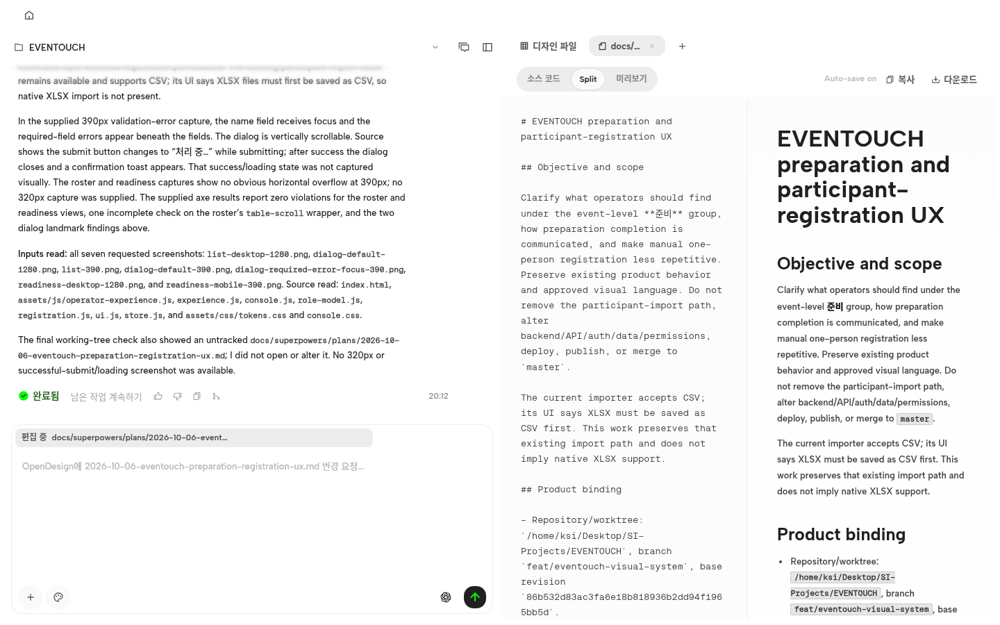
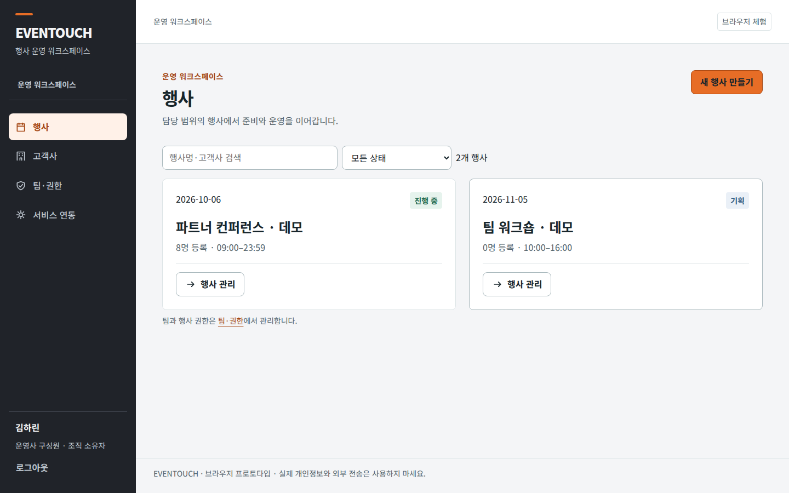

# 개발 흐름 시각 가이드

글로만 설명하면 어려운 부분을 **실제 작업 화면의 과거 캡처**로 보여줍니다. 화면은 흐름을 설명하는 예시이며, 최신 제품 상태나 디자인·기능 검증 완료를 증명하지 않습니다.

## 한눈에 보는 흐름

| 주체 | 하는 일 |
| --- | --- |
| **대표님 (사용자)** | 요청 · 제약 · 완료 기준 · 최종 수용 |
| **OpenCode (Build)** | 작업 계약 · 조율 · 기능 검증 · Git · 보고 |
| **OpenDesign (로컬 실행)** | 분석·감사 → 실제 UI 소스 수정 → 렌더 리뷰(필수) → 결함 목록 → 개선 반복 |
| **실제 제품 (소스)** | 빌드 · 라우팅 · 저장 · 권한 검증 — 스크린샷이 아니라 **동작**으로 확인 |

## 1. OpenDesign 워크스페이스 — 디자인 작업이 일어나는 곳

프로젝트 대화와 파일·문서를 확인하는 워크스페이스 화면입니다. 이 캡처 자체가 디자인 실행 중이거나 UI 렌더 검수를 마쳤다는 뜻은 아닙니다.

- **분석·감사 → UI 소스 수정 → 렌더 리뷰 → 개선**이 이 워크스페이스에서 일어납니다
- 리뷰는 필수 단계이고, 결과는 "좋다/나쁘다"가 아니라 **결함 목록**(무엇이/어느 화면·상태/사용자 영향/원하는 결과)으로 받습니다
- 새 방향이 모호하면 **방향 옵션 2~3개**를 먼저 만들어 고릅니다

## 2. 실제 제품 — 검증과 결과 확인

디자인 변경은 **실제 제품 소스**에 반영되고, OpenCode가 실제 제품에서 기능(라우팅·저장·권한)을 검증합니다.

위 제품 화면은 샘플 데이터가 있는 UI 예시입니다. 검증 결과는 해당 소스 버전의 실행·리뷰 기록에서 별도로 확인해야 합니다.

- 보고는 **리뷰 묶음**으로: 제품 링크(로컬이면 tailnet·임시 표기) + 전/후 스크린샷 + 디자인 프리뷰 링크
- 기능·데이터·권한은 보존하되, 승인된 목적 안에서 **화면 구조·계층·컴포넌트는 재설계**할 수 있습니다

## 더 알아보기

- [README](../README.md) — 설치와 사용 방법
- [OpenDesign 통합 계약](integrations/opendesign.md) — 상세 절차 (감사·옵션·리뷰·개선 규칙)
- [설치 가이드](../INSTALL.md) — 충돌·업그레이드·마이그레이션
